# Creating a Static Website

I'm fairly certain there are infinite paths out here to creating your own static website, and an abundance of people out here willing to show you their
more-or-less clever ways of doing it.  A loosely guiding principle I like to follow for things like this is to keep it simple, and avoid letting so
much "magic" into the mix that it's difficult to comprehend what's really going on behind the scenes.

## What's that "static" word mean here?

Good question.  A "static" website is essentially a specific kind of website in which all of the files that compose it (e.g.  content, image assets,
etc) are ***static*** - meaning they're just sitting on the web server waiting for somebody to ask for them (as-is) without needing any further
processing by the server, interactions with a database, etc.  Technologies like [Drupal](https://www.drupal.org/) and
[Wordpress](https://wordpress.com/) are popular examples of this more traditional style.  Often times, static websites are built using tooling that
allows content to be written in a fairly easy-to-write "language" like [Markdown](https://en.wikipedia.org/wiki/Markdown) and programmatically
rendered into the HTML and other files that are needed to turn them into pages that a web browser can understand.  That's what we'll be doing here.

## What We'll Be Doing

We're going to be using the [Hugo](https://gohugo.io/) static website generator to build a site that is hosted in an AWS S3 bucket, and put a
CloudFront CDN in front of it.  That will enable the use of a custom domain, TLS, and some caching that will take some weight off the shoulders of the
S3 bucket ~~if~~ when it starts getting attention from the internet.  Then, we'll set up CI/CD with CircleCI to handle the tedious technical heavy
lifting of publishing new content to the live site.

These are the high-level steps involved in what we'll be doing:

1. Create a basic static website with Hugo
2. Host the content in a public GitHub repository
3. Buy a domain from AWS (optional)
4. Create an AWS S3 bucket to host the site online
5. Create a TLS certificate
6. Create a AWS CloudFront CDN distribution
7. Set up CI/CD with CircleCI

## Create a basic static website with Hugo

First thing's first - before we go get Hugo, there's some extra tools we'll need - [Git](https://git-scm.com/) to help us version-control our files,
and the [Go runtime](https://go.dev/) because that's what Hugo is built on, and it requires it to work!

Most of the instructions I'm showing here will be best-suited for a machine MacOS or *maybe* some variety of Linux, but the sites I link to usually
have more full-featured equivalents if you're using something else.  We'll be doing this on the command line, so crack open your favorite terminal and
lets go to it.


### Install Git

Install Git using homebrew, the package manager for MacOS:

```bash
brew install git
```

Verify that it's installed correctly by running:

```bash
git version
```

### Install Go

Install Go by downloading the latest package [published here](https://go.dev/dl/) and installing it the same way you'd install anything else.  If
everything went well, you should be able to run:

```bash
go version
```

and see the version you installed printed out.

### Install Hugo

Now, we should be ready to go get Hugo and install that.  OS-specfic instructions are [published here](https://gohugo.io/installation/), but if you're
using MacOS, you can run:

```bash
brew install hugo
```

### Initialize the Site

Starting in the directory where the site will be saved locally, run the following to have the Hugo CLI scaffold a new static site in a folder named
`HugoSite` or whatever else you'd like to call it.

```bash
hugo new site HugoSite
```

Now, go into that folder, and we'll use Git to initialize it as a new Git repository so that the files are version controlled. 

```bash
cd HugoSite
git init
git branch -m main
```

We'll create a new post in the site using the Hugo CLI again:

```bash
hugo new posts/first-post.md
```

Hugo will scaffold out a new markdown file in the `content/posts/` directory.  This is where you'll write the content for that post.  At the top,
you'll notice some stuff that looks like a header of some kind.

```yaml
---
title: "Creating a Static Website"
date: 2023-06-11T07:14:53-04:00
draft: true
---
```

Hugo calls this [Front Matter](https://gohugo.io/content-management/front-matter/).  It's basically metadata that you mostly don't need to worry about
too much for now, but you can read more about it later.  For now, just remove the `draft: true` line from this and any future posts that you want to
be published to the site.

Now add some content to the post in Markdown.
[Here's some solid test copy](https://github.com/theNewDynamic/gohugo-theme-ananke/blob/master/exampleSite/content/en/post/chapter-1.md?plain=1) you
can use for now.

Next, lets install a theme. [Ananke](https://github.com/theNewDynamic/gohugo-theme-ananke) seems to be pretty widely recommended. Use your terminal to run:

```bash
hugo mod init github.com/<your_user>/HugoSite
```

Now, in the root of your project, you'll see a config file called `hugo.toml`, where there's lots of configuration settings. Open that up, and you'll see a line that looks like 

```toml
theme = ''
```

Replace that with this to activate the theme you just installed:

```toml
theme = ["github.com/theNewDynamic/gohugo-theme-ananke"]
```

In your terminal, we can start a process that allows us to preview our site with automatic update detection by running:

```bash
hugo serve --disableFastRender -D
```

The site it now available at http://localhost:1313!

Now use git to commit all of the files you've just created, and we'll go over to GitHub to host them.

```bash
git add --all
git commit --all --message "committing first post"
```

## Host the content in a public GitHub repository

If you don't already have a GitHub account, go make one and log into it.  Go to your repositories, and click the green "New" button to set up a new
repo.  Name it whatever you like (we've been using the name "HugoSite" so far), then scroll down to the bottom and click "Create Repository".  

Once it's created, copy the "clone URL" that will look something like this:

```plaintext
https://github.com/YourUsername/your-repo-name.git
```

Back in your terminal, we'll configure the local repository where you've been creating content to link up to the repository you just created in GitHub
by adding a "remote" (GitHub) and pushing our commits there.  You'll be prompted for your GitHub credentials, so just take care of that quick.

```bash
git remote add origin MY_CLONE_URL
git push --set-upstream origin main
```

Your files are now in your GitHub repo!  Now, we need a place to host our site and a domain to access it with.

## Buy a domain from AWS (optional)

You don't have to do this part, but if you'd like the site to have a clever URL, then you'll need to. 

If you don't already have an AWS account, [you'll need to get one](https://aws.amazon.com/).  Not to fear, at the end of the day they're trying to
sell you paid services, so they make it exceedingly easy to sign up.

Once you're signed up and logged in, use the search bar at the top of the page to navigate to a tool called "Route53".  This is the tool you use to
buy domains and manage DNS entries in AWS.

The AWS UI changes so frequently that there's not really much point in adding screenshots here.  You'll need to find the button for registering a new
domain.  There will be a text box where you can search for domains to see if they're available, and if so, the annual cost to purchase them.  Keep
trying until you find one you like, and buy it!

## Create an AWS S3 bucket to host the site online

Now that you have a domain, we need to create a place to host the site online, once we use Hugo to compile the Markdown files you write into HTML,
CSS, and JavaScript.  We'll be using an AWS S3 bucket to do this.  S3 is normally used as a simple "object storage" solution for saving regular files
in the cloud.

Use the search-bar at the top of the AWS console to go to the S3 tool.  Click the button to create a new bucket.

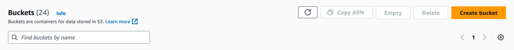

Configure the name of the bucket to the name of the domain you just bought (if you did).

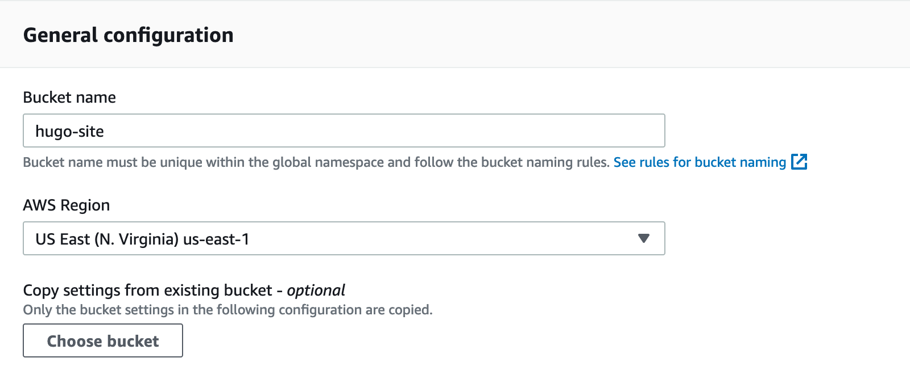

Un-check the box(es) for disabling public access to the bucket.

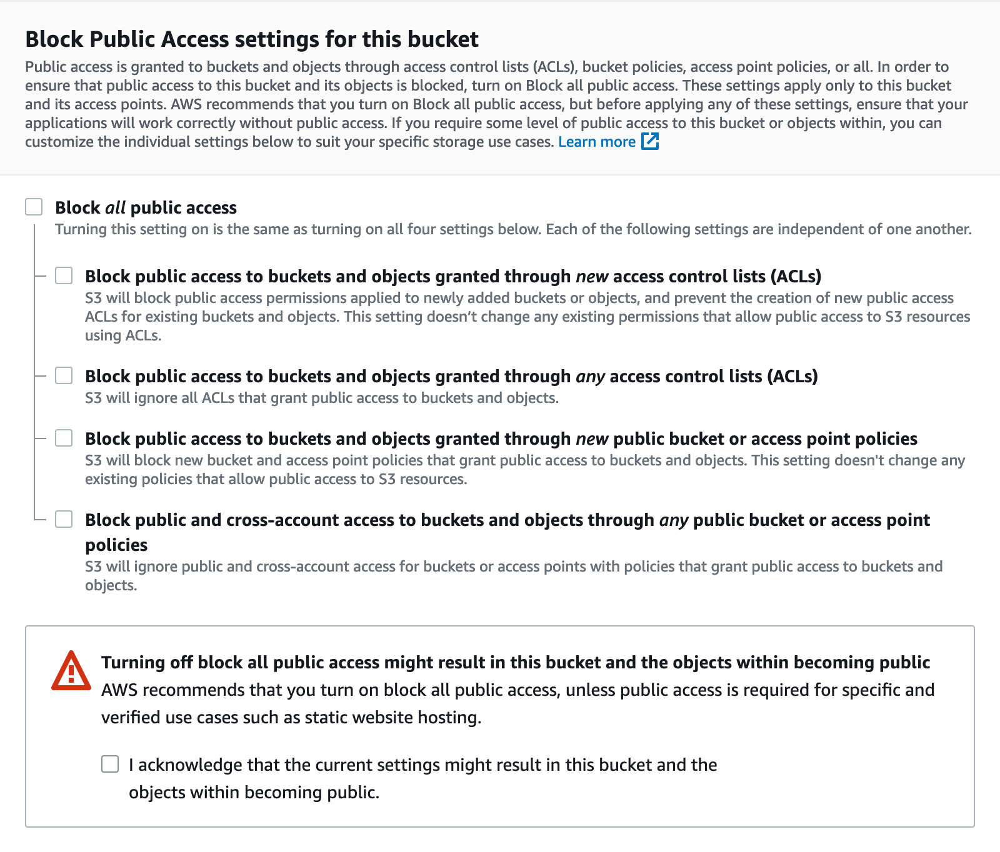

Click the "Create Bucket" button at the bottom of the page

Once you've created the bucket, open it and go to the "Properties" tab at the top of the page.  Scroll down to the Static Website Hosting
configuration, and edit it.

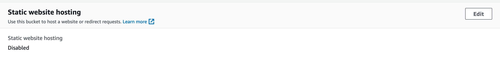

Enable static hosting on this bucket, and set both the index and error pages like so.  This will effectively turn your S3 bucket into a publicly
accessible web server.

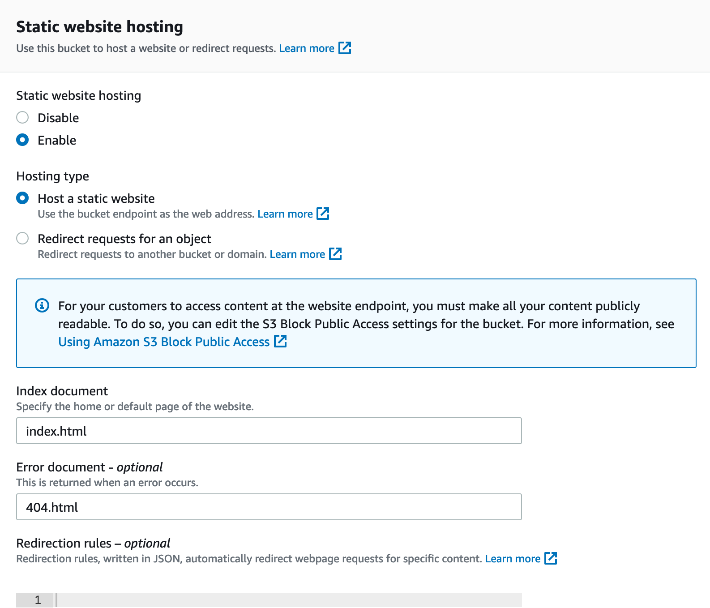

Now go back to the bucket and open the "Permissions" tab at the top of the page.  Scroll down to the Bucket Policy configuration section, and edit it.

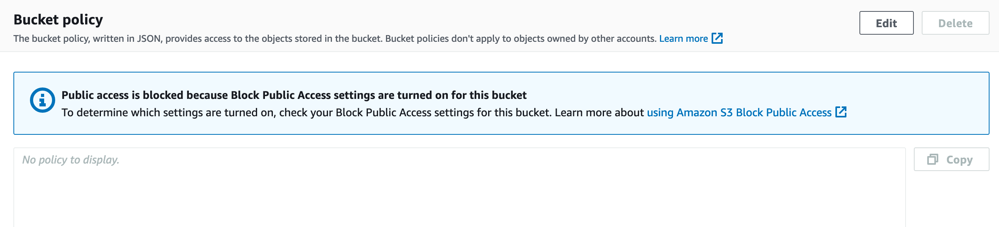

Enter the following bucket policy into the editor and save it.  Replace `MY_BUCKET_NAME` with the exact name of the bucket you created.  This will
make all current and future objects in this bucket publicly accessible over the internet.  

```json
{
    "Version": "2012-10-17",
    "Statement": [
        {
            "Sid": "PublicRead",
            "Effect": "Allow",
            "Principal": "*",
            "Action": "s3:GetObject",
            "Resource": "arn:aws:s3:::MY_BUCKET_NAME/*"
        }
    ]
}
```

Your hosting is configured!  Now we need a TLS certificate to ensure that the content is delivered securely to readers.

## Create a TLS certificate

If you purchased a domain from AWS, this step is super easy.  In the console, search for a tool called "Certificate Manager".  Click the button to
request a new certificate.

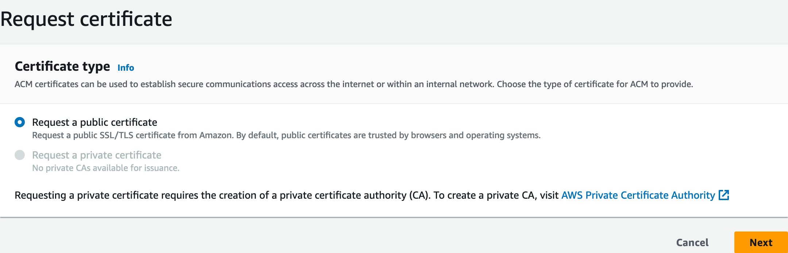

Type your domain name into the form and leave the defaults as they are - they're more than sufficient.  Click the request button.

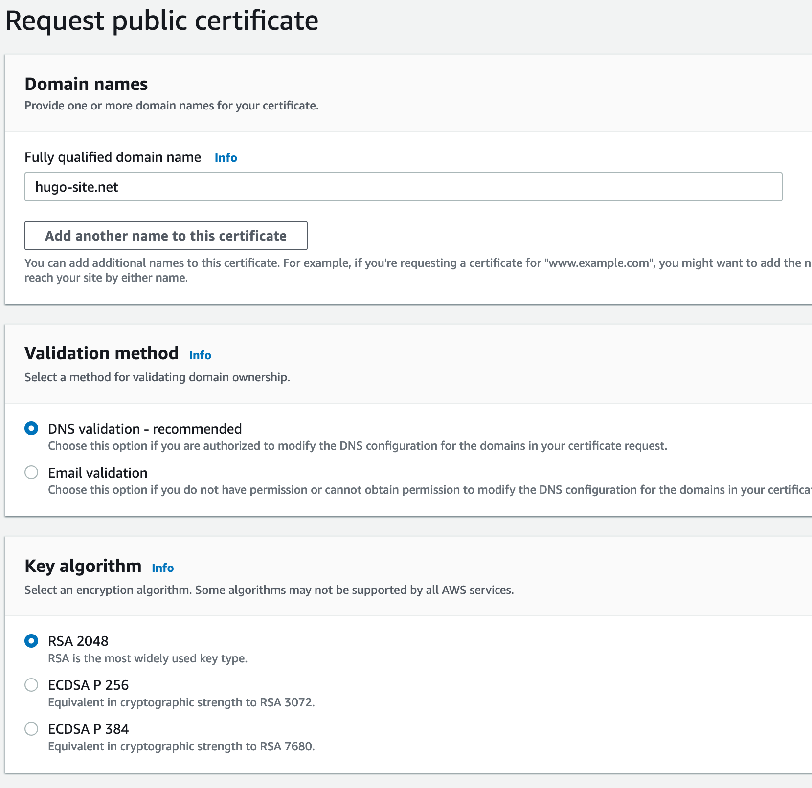

You will now need to prove to AWS that you own the domain you requested the certificate for.  Normally, you'd do this by manually adding a temporary
new DNS entry under your domain that resolves to a pre-defined value AWS came up with on the fly.  If you can do that, then you must own the domain.
Since we bought the domain through AWS, all of this is automated, just click the certificate entry (that should now be pending validation), and click
the button to "Create Records in Route 53".

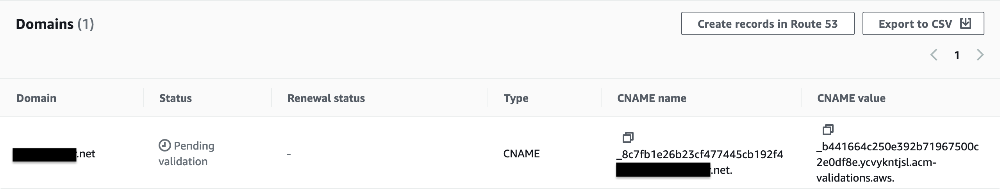

In a moment, you'll have a new TLS certificate provisioned in AWS! We can use this to configure our CloudFront distribution.

## Create a AWS CloudFront CDN distribution

CloudFront will help with the following:

1. Add a layer of caching in front of our S3 bucket that will help keep data transfer costs down
2. Make requests faster by caching the site's content in multiple geographical locations throughout the world, bringing the content physically closer to readers.
3. Enable the site to be accessed via the custom domain that was purchased instead of the ugly default URLs
4. Enable the site to use TLS, which delivers content securely using asymmetric encryption

In the AWS console, search for a tool called CloudFront.  Click the button to create a new distribution.  In the "Origin domain" box, choose the S3
website endpoint for the bucket you configured earlier.

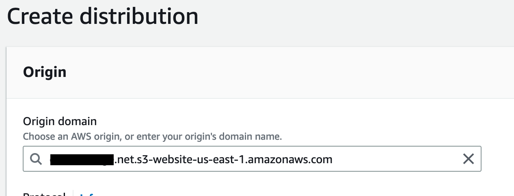

In the Default Cache Behavior section, make sure that compression is turned on, and that HTTP requests are redirected to the HTTPS equivalent.

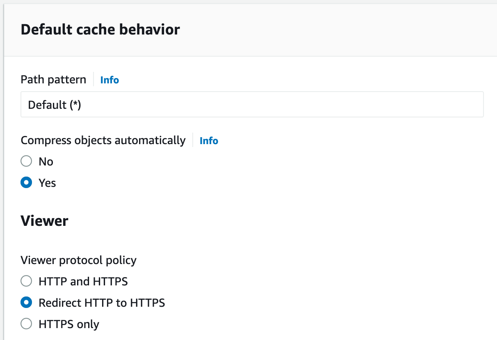

Configure the caching optimized cache policy, which is recommended for S3 origins.

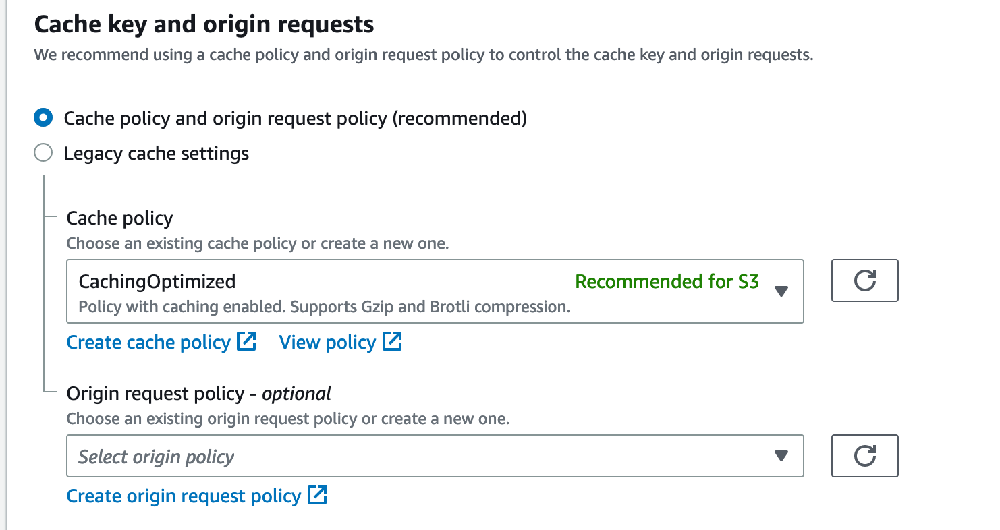

Leave WAF turned off for now.  You can always turn it on later, and it will cost you at least a few extra dollars every month.

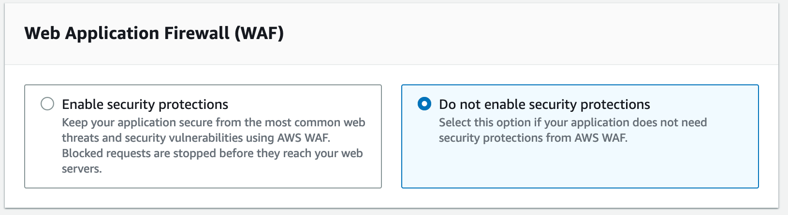

In the alternate domain names section, add the domain that you just purchased from AWS.  Then, select the certificate you just created as your SSL
(TLS) certificate.  Check the boxes to enable support for HTTP/2 and HTTP/3.

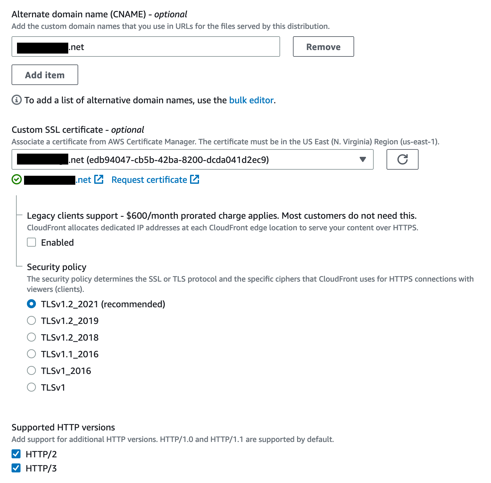

Click "Create Distribution" at the bottom of the page to start deploying the CDN across the world!

## Set up CI/CD with CircleCI

Now, we need to set up a system that will automatically build and deploy your content out to your S3 website as you write it, without you having to do
anything other than push changes to GitHub.  To do that, we'll use [Circle CI](https://circleci.com/).

Log in with GitHub, and allow Circle CI to walk you through the process of linking your account and following your public repo(s).

Next, create a new file in your site called `.circleci/config.yml`, and paste the following content into it.  Be sure to replace MY_BUCKET_NAME with
the name of your S3 bucket.  This is configuration that can tell Circle CI how to build your site, and where to deploy it to.

```yaml
version: 2.1

jobs:
  build:
    docker:
      - image: cimg/go:1.20
    steps:
      - checkout
      - run:
          name: "Install Hugo"
          command: "wget -O hugo.deb https://github.com/gohugoio/hugo/releases/download/v0.113.0/hugo_0.113.0_linux-amd64.deb && sudo dpkg -i hugo.deb"
      - run:
          name: "Build Site"
          command: "hugo"
      - persist_to_workspace:
          root: public
          paths:
            - "*"
  deploy:
    docker:
      - image: amazon/aws-cli
    steps:
      - run:
          name: "Install Tools"
          command: "yum install -y tar gzip"
      - attach_workspace:
          at: /siteData
      - run:
          name: "Deploy Site"
          command: "aws s3 cp --recursive /siteData s3://MY_BUCKET_NAME"

workflows:
  release:
    jobs:
      - build
      - deploy:
          requires:
            - build
          filters:
            branches:
              only: main

```

Commit this file and push it to your GitHub repository like before.  In Circle CI, click the "Setup Project" button to set up a build and deploy
pipeline for your app.  In the popup that appears, tell Circle CI to use the above config file that you just committed to GitHub.

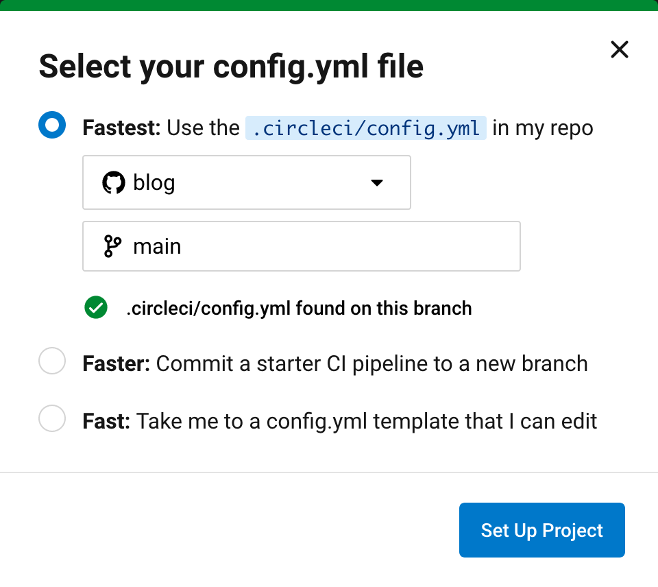

Once you do this, Circle CI will immediately start building your project.  It will fail when it tries to deploy to S3 because it needs you to give it
credentials to use to connect to S3 on your behalf.  To fix this, we'll go back to AWS, and create a new user that has its own key ID and secret that
you can use for Circle CI.  This new user will only have permissions to do stuff that we need Circle CI to be able to do - deploy to S3 buckets.  This
is a step in the right direction toward the [least-privilege security best-practice](https://en.wikipedia.org/wiki/Principle_of_least_privilege).  I
*strongly* encourage resisting the temptation to either assign full permissions to this user, or forgo creating this user altogether and giving Circle
CI the credentials for your root user.  *Don't do it!*

In the AWS console, search for "IAM".  Under "Access Management" > "Users", click the button to create a new user.

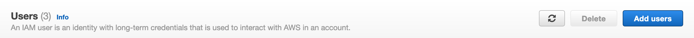

Give the user a name and continue through the configuration menu.

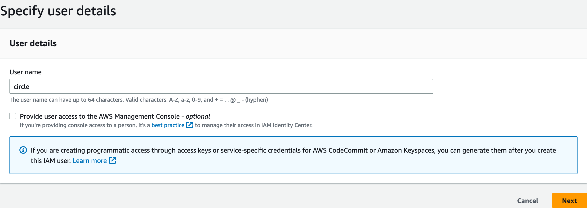

Assign a policy (i.e.  set of permissions) to the user that only allows it to interact with S3.  Even though we could restrict access to this
particular bucket, this is a nice balance between security and convenience because it prevents you from needing to come back and mess with this later,
should you use Circle CI to deploy things to other S3 buckets in the future.

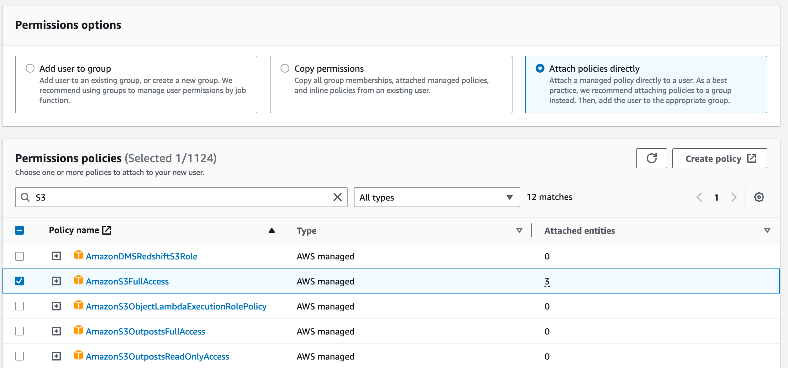

Now that you have a user, we need to create a set of credentials for it that we can give to Circle CI.  Open the user, click the "Security
Credentials" tab, and scroll down until you see a section for Access Keys.  Click the button to create one. 

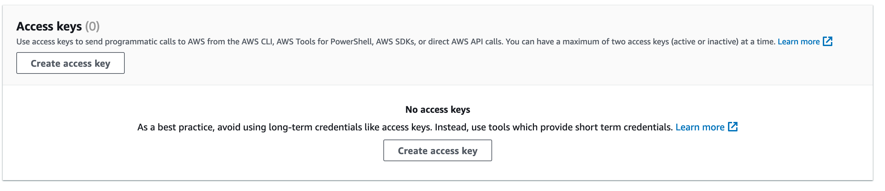

AWS will try to take the opportunity to understand why you're doing this, and potentially talk you into an alternative approach if it makes sense, but just
go ahead and select "Other" to breeze through it.  We've got this. 

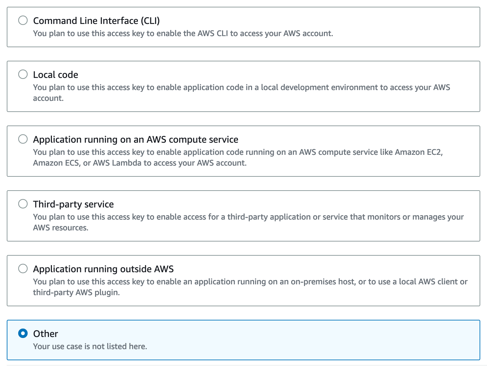

Copy down the Access Key and Secret Access Key.  Go back to your project in Circle CI and go to "Project Settings".

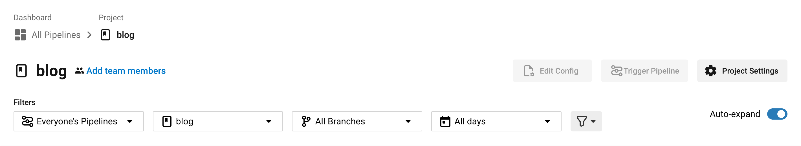

Select Environment Variables from the left sidebar, and add 2 new variables, called `AWS_ACCESS_KEY_ID` and `AWS_SECRET_ACCESS_KEY`.  Set these
variables with the access key and secret access key for the IAM user that you just created.  

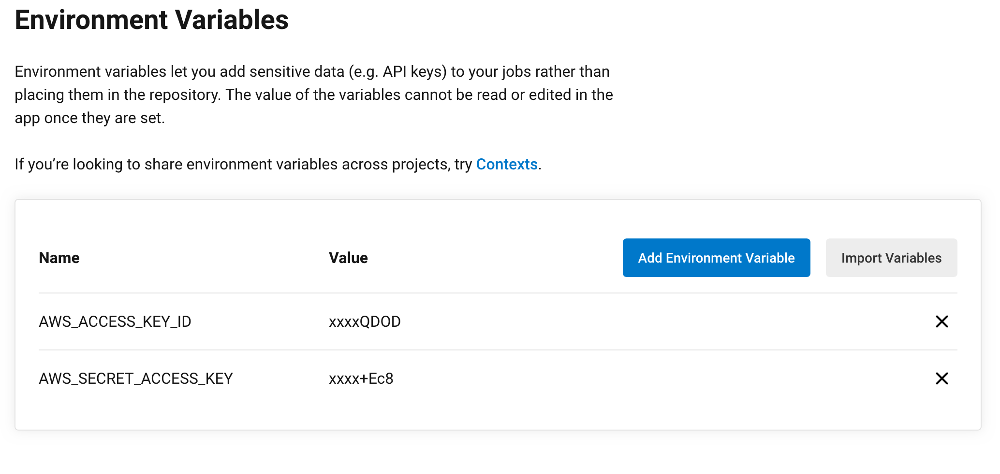

Now go back to your project, and use the button on the right-side to re-run the failed deployment from the beginning. 

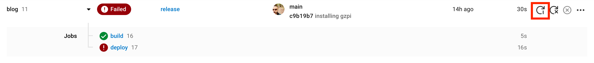

 Now that Circle CI has credentials to deploy to S3, it'll work!

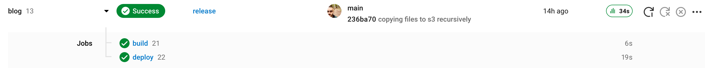

With a little bit of luck, you should be able to type the domain you bought into the address bar of your favorite browser, and see your site, live on
the internet!  From now on, any time you make changes to the site and push them to the `main` branch of your GitHub repo, CircleCI will instantly
detect it and get right to work deploying it out to your S3 bucket.